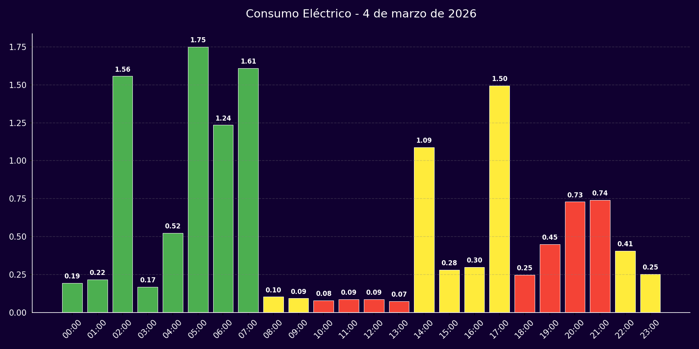
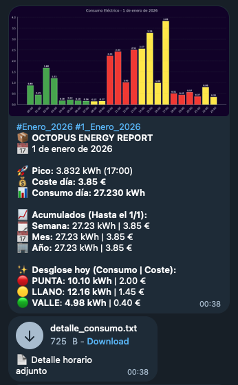

#  Octop-Cons ⚡



**Octop-Cons** is an intelligent, automated tool designed to extract, analyze, and report electricity consumption from your **Octopus Energy** account. It uses `Playwright` to navigate the user dashboard, extract hourly consumption data, and send a detailed report via Telegram with charts generated by `matplotlib`.

---

## ✨ Features

- **Automated Scraping**: Accesses your Octopus Energy account daily to retrieve consumption data from the previous day (usually with a 2-day standard delay).
- **Telegram Reports**: Sends a comprehensive summary including:
  - 📊 **Bar Chart** of hourly consumption, color-coded by period (Peak 🔴, Flat 🟡, Off-Peak 🟢).
  - 💰 **Cost Breakdown** daily, weekly, monthly, and yearly.
  - 📄 **Hourly Detail** attached as a text file.

  <div align="center">
    
  </div>

- **Error & Gap Detection**:
  - If Octopus hasn't published data yet ("No data"), it waits and retries every 30 minutes.
  - If data is incomplete (some intervals showing 0 kWh), it notifies about the "Gap" and waits for updates.
- **Persistent History**: Saves a historical record in `data_history.json` to avoid unnecessary queries and enable accumulated calculations.
- **Daemon Mode (`--auto`)**: Continuous execution mode that automatically checks for or recovers pending days.

---

## 🛠️ Prerequisites

- **Python 3.10+** (Recommended).
- **Google Chrome / Chromium**: Required for `Playwright`.
- **Clawdbot**: External tool used to send messages to Telegram (must be installed and configured in your PATH or accessible by the system).
- **Octopus Energy Account**: User email and password.

---

## 🚀 Installation

1. **Clone the repository**:
   ```bash
   git clone https://github.com/mtorregrosadev/Octop-Cons.git
   cd Octop-Cons
   ```

2. **Create a virtual environment (Recommended)**:
   ```bash
   python3 -m venv venv
   source venv/bin/activate  # On Windows: venv\Scripts\activate
   ```

3. **Install dependencies**:
   ```bash
   pip install playwright python-dotenv matplotlib holidays
   playwright install  # Installs necessary browsers for Playwright
   ```

---

## ⚙️ Configuration

1. **Environment Variables**:
   Create a `.env` file in the project root (you can use `.env.example` as a base) and add your credentials:

   ```env
   OCTOPUS_USER=your_email@example.com
   OCTOPUS_PASS=your_password
   TELEGRAM_TARGET=-100XXXXXXXXXX  # Telegram Chat/Channel ID
   ```

2. **Script Configuration (`scraper.py`)**:
   Some variables are defined directly in the code (lines 20-40) and might need adjustment:
   - `ACCOUNT_ID`: Your Octopus account ID (e.g., `A-8FXXXXXX`).
   - `TELEGRAM_THREAD_ID`: If using a group with Topics, set the thread ID (default is "38").
   - **Prices & Taxes**: Updated as of February 2026. If they change, edit constants like `PRICE_PUNTA`, `PRICE_LLANO`, `PRICE_VALLE`, etc.

---

## 📦 Usage

### 1. Manual Execution (Standard Day)
Retrieves data from 2 days ago (standard Octopus publication time) and fills gaps if found in history.
```bash
python scraper.py
```

### 2. Execution for Specific Date
Force download for a specific day (YYYY-MM-DD format).
```bash
python scraper.py 2024-02-22
```

### 3. Automatic Mode (Daemon)
Starts an infinite loop that periodically checks for new data or pending days to recover. Ideal for running on a server (e.g., with `nohup`).
```bash
python scraper.py --auto
```

---

## 📂 File Structure

```
Octop-Cons/
├── scraper.py
├── data_history.json
├── user_data/
├── last_chart.png
├── detalle_consumo.txt
├── .env
├── .env.example
└── README.md
```

**File descriptions:**
- **`scraper.py`**: Main script. Handles web navigation, data extraction, chart generation, and Telegram reporting.
- **`data_history.json`**: Local database with daily consumption history.
- **`user_data/`**: Directory where browser session (cookies, cache) is stored to avoid constant logins.
- **`last_chart.png`**: Temporary image of the last generated chart.
- **`detalle_consumo.txt`**: Temporary file with the hourly detail of the last processed day.

---

## ⚠️ Important Notes

- **Login & Captchas**: The script uses a "persistent context" (`user_data/`). If running for the first time or after a long break, you might need to manually solve a captcha or validate a new device.
- **Clawdbot**: This project relies on the external tool `clawdbot` to communicate with Telegram. Ensure the bot has permissions in the configured channel/group.
- **Disclaimer**: This software is not official from Octopus Energy. Use it at your own risk.

---

Created with ❤️ and lots of caffeine ☕ by [mtorregrosadev](https://github.com/mtorregrosadev).

