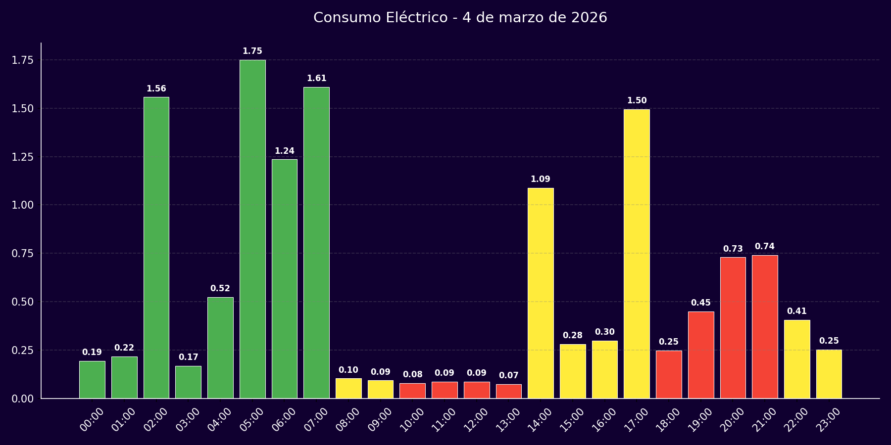
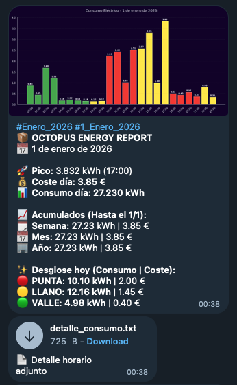

# Octop-Cons ⚡



Octop-Cons retrieves hourly electricity consumption from the Octopus Energy Spain customer dashboard, calculates estimated costs and sends a daily report to Telegram. Reports include a chart, period breakdown and hourly detail file.

Telegram delivery uses the official HTTP Bot API directly. No external messaging gateway is required.

## Features

- Persistent Playwright session for the Octopus Energy dashboard.
- Daily, date-specific, date-range and continuous execution modes.
- Peak, flat and off-peak consumption and cost breakdown.
- Daily, weekly, monthly and yearly totals.
- Telegram text, photo and document delivery.
- Support for Telegram forum topics through `TELEGRAM_THREAD_ID`.
- Retry handling for network errors, rate limits and Telegram 5xx responses.
- Local queue with per-report media snapshots when delivery is unavailable.
- Duplicate-send protection and historical gap recovery.
- Full-day GAP protection: if any interval is `0 kWh`, the report is held back and Telegram receives an alert listing the affected hours.

<p align="center">
  
</p>

## Requirements

- Python 3.10 or newer.
- An Octopus Energy Spain account.
- A Telegram bot created with [@BotFather](https://t.me/BotFather).
- Chromium installed through Playwright.

## Installation

```bash
git clone https://github.com/mtorregrosadev/Octop-Scraper.git
cd Octop-Scraper

python3 -m venv .venv
source .venv/bin/activate
pip install -r requirements.txt
playwright install chromium
cp .env.example .env
```

## Configuration

Edit `.env` and keep it private:

```env
OCTOPUS_USER=you@example.com
OCTOPUS_PASS=your_password
OCTOPUS_ACCOUNT_ID=A-XXXXXXXX

TELEGRAM_BOT_TOKEN=your_botfather_token
TELEGRAM_TARGET=-100XXXXXXXXXX
TELEGRAM_THREAD_ID=
```

| Variable | Description |
| --- | --- |
| `OCTOPUS_USER` | Octopus Energy login email. |
| `OCTOPUS_PASS` | Octopus Energy password. |
| `OCTOPUS_ACCOUNT_ID` | Account identifier from the Octopus dashboard URL. |
| `TELEGRAM_BOT_TOKEN` | Token generated by @BotFather. |
| `TELEGRAM_TARGET` | Destination user, group or channel ID; a public channel username is also accepted. |
| `TELEGRAM_THREAD_ID` | Optional forum topic ID. Leave empty when Topics are not used. |

Add the bot to the destination group or channel and grant it permission to post messages and files. For a forum group, use the topic identifier as `TELEGRAM_THREAD_ID`.

Prices, taxes and contracted power are constants near the top of `scraper.py`; adjust them to match the active tariff before relying on cost estimates.

## Verify Telegram

Send a harmless connection message without running the scraper:

```bash
python scraper.py --test-telegram
```

Retry all locally queued reports after the connection succeeds:

```bash
python scraper.py --flush-pending
```

## Usage

Retrieve the standard target day, currently two days ago:

```bash
python scraper.py
```

Retrieve a specific date:

```bash
python scraper.py 2026-07-10
```

Retrieve a range in one browser session:

```bash
python scraper.py --range 2026-07-01 2026-07-10
```

Add `--visible` to date or range commands when the browser must remain visible for login verification or debugging.

Run continuously:

```bash
python -u scraper.py --auto
```

`run-launchagent.zsh` is a portable runner for macOS LaunchAgents. It locates `.venv`, `venv` or `venv313` relative to the repository rather than relying on a user-specific path.

## Historical recovery

`recover_history.py` provides an interactive wrapper around range recovery. By default, recovered days are queued silently to avoid flooding Telegram.

```bash
python recover_history.py
```

## Invoice calculator

The optional calculator estimates a bill from consumption totals:

```bash
python calculadora.py PUNTA_KWH LLANO_KWH VALLE_KWH [DAYS] [POWER_KW]
```

## Local data and privacy

The repository ignores credentials, browser profiles and generated consumption data:

- `.env`
- `user_data*/`
- `data_history*.json`
- `pending_reports.json` and `sent_reports.json`
- `pending_media/`
- `last_chart.png` and `detalle_consumo.txt`
- log files and Python virtual environments

Do not commit a real `.env` file or a Playwright profile. A Telegram bot token grants control of the bot and should be rotated immediately if exposed.

## Tests

Run the unit tests and syntax checks locally:

```bash
python -m unittest discover -s tests -v
python -m py_compile scraper.py recover_history.py calculadora.py
```

GitHub Actions runs the same checks on pushes and pull requests.

## Project structure

```text
.
├── scraper.py               Main scraper and Telegram delivery
├── recover_history.py       Interactive historical recovery
├── calculadora.py           Standalone invoice estimator
├── run-launchagent.zsh      Portable macOS daemon runner
├── requirements.txt
├── .env.example
├── tests/
└── src/                     Documentation images
```

## Notes

- The first login may require a captcha or device verification. Run once with `--visible` so the persistent browser profile can store the session.
- Octopus may publish consumption data with a delay. The automatic mode waits and retries incomplete days.
- Cost calculations are estimates and are not a replacement for the official Octopus Energy invoice.

## License

[MIT](LICENSE)
